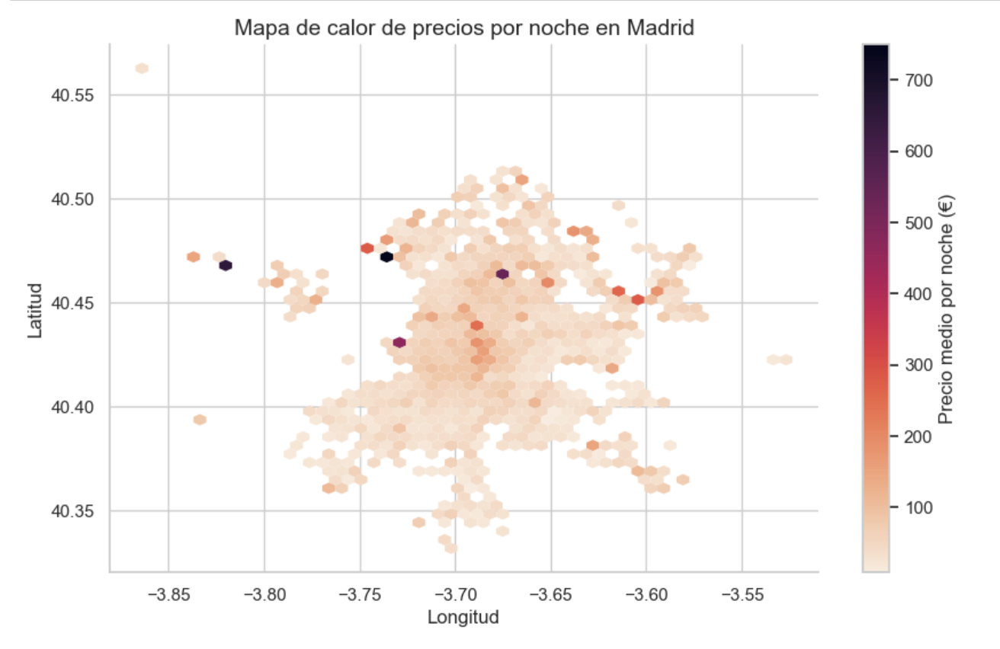
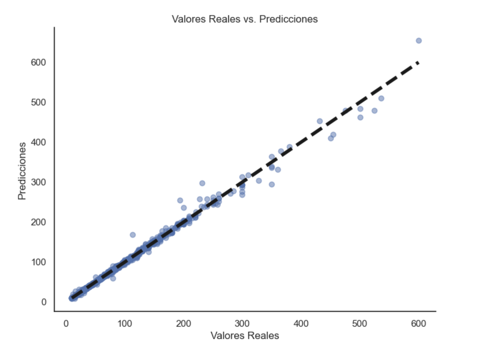

# Predicción del Precio de Alojamientos de Airbnb con Machine Learning 🏘️

## Introducción
Este proyecto utiliza técnicas de Machine Learning para **predecir el precio diario de los alojamientos** utilizando un conjunto de datos extraído de Airbnb. El objetivo es aplicar un **modelo de regresión** que considere múltiples características para realizar predicciones precisas. La práctica se ha desarrollado en [cuadernos de Jupyter](https://jupyter.org/), aprovechando la versatilidad y la potencia de [scikit-learn](https://scikit-learn.org/stable/), una biblioteca de aprendizaje automático de código abierto para Python que facilita la implementación de algoritmos de Machine Learning complejos.

## Enmarcación del Problema
- **Tipo de Aprendizaje:** Supervisado, específicamente regresión múltiple y univariante.
- **Objetivo:** Predecir el precio de la vivienda por día basándonos en diversas características.

## Recopilación de Datos
El conjunto de datos proviene de [Opendatasoft Airbnb Listings](https://public.opendatasoft.com/explore/dataset/airbnb-listings/export/?disjunctive.host_verifications&disjunctive.amenities&disjunctive.features&q=Madrid&dataChart=eyJxdWVyaWVzIjpbeyJjaGFydHMiOlt7InR5cGUiOiJjb2x1bW4iLCJmdW5jIjoiQ09VTlQiLCJ5QXhpcyI6Imhvc3RfbGlzdGluZ3NfY291bnQiLCJzY2llbnRpZmljRGlzcGxheSI6dHJ1ZSwiY29sb3IiOiJyYW5nZS1jdXN0b20ifV0sInhBeGlzIjoiY2l0eSIsIm1heHBvaW50cyI6IiIsInRpbWVzY2FsZSI6IiIsInNvcnQiOiIiLCJzZXJpZXNCcmVha2Rvd24iOiJyb29tX3R5cGUiLCJjb25maWciOnsiZGF0YXNldCI6ImFpcmJuYi1saXN0aW5ncyIsIm9wdGlvbnMiOnsiZGlzanVuY3RpdmUuaG9zdF92ZXJpZmljYXRpb25zIjp0cnVlLCJkaXNqdW5jdGl2ZS5hbWVuaXRpZXMiOnRydWUsImRpc2p1bmN0aXZlLmZlYXR1cmVzIjp0cnVlfX19XSwidGltZXNjYWxlIjoiIiwiZGlzcGxheUxlZ2VuZCI6dHJ1ZSwiYWxpZ25Nb250aCI6dHJ1ZX0%3D&location=16,41.38377,2.15774&basemap=jawg.streets), centrado en la Comunidad de Madrid.

## Preguntas de Investigación
- Influencia de la información del anfitrión en el precio.
- Relevancia de las características geográficas.
- Características directas que impactan el precio.
- Efecto de las métricas de reserva, disponibilidad, calidad y popularidad.

## Análisis Exploratorio de Datos (EDA) 
Se realiza un análisis exploratorio centrado en:
- Información del anfitrión.
- Información geográfica.
- Características directas del alojamiento.
- Precios y costos adicionales.
- Restricciones de reserva y disponibilidad.
- Métricas de calidad y popularidad.

### Preparación de los Datos
- Filtrado inicial: Se seleccionan registros exclusivos de la Comunidad de Madrid.
- Limpieza de datos: Eliminación de columnas no deseadas, codificación de variables categóricas, y división de los datos en conjuntos de entrenamiento y prueba.

## Modelado
Se exploran varios modelos (Árbol de Decisión, Random Forest, Bagging Regressor, Gradient Boosting, etc.) para encontrar el mejor en términos de precisión y robustez.

### Selección de Características
Se identifican las variables más significativas para el precio, como `PricePerBed`, `Cleaning Fee`, `Room Type`, `BedBathRooms`, entre otras.

### Ajuste y Optimización del Modelo
Se realizan ajustes en los modelos utilizando las características identificadas como más significativas. Se busca minimizar el sobreajuste observado inicialmente y mejorar la generalización del modelo en datos no vistos.

### Evaluación de Modelos y Métricas de Regresión
Para evaluar la efectividad de los diferentes modelos, se utilizan varias métricas:
- **Error Absoluto Medio (MAE):** Proporciona una visión directa del error promedio sin penalizar excesivamente los errores grandes.
- **Raíz del Error Cuadrático Medio (RMSE):** Ofrece una medida sensible a los errores grandes, lo que es útil para evitar subestimaciones costosas.
- **Error Cuadrático Medio (MSE):** Útil cuando los errores grandes son inaceptables, aunque puede ser sensible a valores atípicos.
- **Coeficiente de Determinación (R²):** Mide cuánta variación de los datos puede explicarse por el modelo. Un valor más alto indica un mejor ajuste.

Se realiza una comparación detallada de cómo cada modelo se desempeña según estas métricas, permitiendo seleccionar el modelo que mejor equilibre precisión y robustez frente a datos nuevos.

### Ajuste Fino y Validación
Se ajustan los parámetros de los modelos seleccionados mediante técnicas como la **validación cruzada** y la búsqueda en cuadrícula *(GridSearchCV)* para encontrar la configuración óptima que *maximice la precisión y minimice el error*. Este proceso también ayuda a confirmar la robustez del modelo y su capacidad para generalizar bien a partir de datos no vistos.

## Conclusiones
Durante mi práctica en el módulo de Machine Learning, he probado varios modelos y analizado sus puntos fuertes y áreas de mejora. Después de un análisis cuidadoso, he elegido el *Gradient Boosting Regressor* por su buen rendimiento. Esta elección refleja mi búsqueda de un modelo con buen rendimiento y mi crecimiento personal en este campo. Este proceso ha aumentado mi motivación por seguir aprendiendo y me ha enseñado el valor de la perseverancia y la curiosidad en el mundo del Machine Learning. Reconozco que todavía tengo mucho que aprender y estoy emocionada por enfrentar los desafíos futuros que me ayudarán a crecer en esta disciplina.